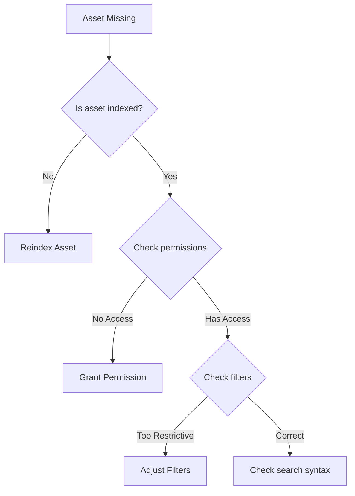

# Module 3: Common Issues and Solutions

## Duration: 6 hours

## Learning Objectives
By the end of this module, trainees will be able to:
1. Identify and resolve the most common MAMS issues
2. Use systematic troubleshooting approaches
3. Apply appropriate solutions for each issue type
4. Document issues and resolutions
5. Know when to escalate

## 1. Top 10 Most Common Issues

### 1.1 Login/Authentication Issues (25% of tickets)

#### Issue: "Cannot log in"
**Symptoms**:
- Invalid credentials error
- Account locked message
- MFA not working
- Session expired quickly

**Diagnosis Steps**:
1. Verify username/email is correct
2. Check account status in database
3. Review login attempt history
4. Verify MFA device time sync
5. Check session timeout settings

**Solutions**:
```bash
# Reset password
curl -X POST http://api-gateway:8000/api/v1/users/reset-password \
  -H "Content-Type: application/json" \
  -d '{"email": "user@example.com"}'

# Unlock account
UPDATE users SET locked_until = NULL, failed_attempts = 0 
WHERE email = 'user@example.com';

# Check MFA status
SELECT mfa_enabled, mfa_secret FROM users WHERE email = 'user@example.com';

# Extend session timeout
UPDATE settings SET value = '7200' WHERE key = 'session_timeout_seconds';
```

#### Issue: "Permission Denied"
**Root Causes**:
- Missing role assignment
- Expired permissions
- Wrong project access
- Feature not included in plan

**Resolution Script**:
```sql
-- Check user roles
SELECT r.name, r.permissions 
FROM users u
JOIN user_roles ur ON u.id = ur.user_id
JOIN roles r ON ur.role_id = r.id
WHERE u.email = 'user@example.com';

-- Grant role
INSERT INTO user_roles (user_id, role_id) 
VALUES ('user-uuid', 'editor-role-uuid');

-- Check project permissions
SELECT * FROM project_members 
WHERE user_id = 'user-uuid' AND project_id = 'project-uuid';
```

### 1.2 Upload Failures (20% of tickets)

#### Issue: "Upload stuck at X%"
**Common Causes**:
- Network interruption
- File size limits
- Storage quota exceeded
- Unsupported format

**Troubleshooting Checklist**:
- [ ] Check file size vs limits
- [ ] Verify storage quota
- [ ] Test network connectivity
- [ ] Check supported formats
- [ ] Review proxy settings

**Solutions**:
```bash
# Check upload limits
curl http://api-gateway:8000/api/v1/config/upload

# View user quota
curl http://storage:8002/api/v1/users/{user-id}/quota

# Resume failed upload
curl -X POST http://ingest:8007/api/v1/uploads/{upload-id}/resume

# Clear stuck upload
DELETE FROM upload_sessions WHERE id = 'upload-uuid' AND status = 'stuck';
```

#### Issue: "File type not supported"
**Supported Formats**:
```json
{
  "video": ["mp4", "mov", "avi", "mkv", "mxf", "prores"],
  "audio": ["mp3", "wav", "aiff", "flac", "m4a"],
  "image": ["jpg", "png", "tiff", "raw", "psd", "ai"],
  "document": ["pdf", "doc", "docx", "xls", "xlsx", "ppt", "pptx"]
}
```

**Adding Format Support**:
```bash
# Update configuration
curl -X PUT http://api-gateway:8000/api/v1/admin/formats \
  -H "Authorization: Bearer {admin-token}" \
  -d '{"format": "webm", "type": "video", "mime": "video/webm"}'
```

### 1.3 Search Not Finding Assets (15% of tickets)

#### Issue: "Asset not showing in search"
**Diagnosis Flow**:


**Solutions**:
```bash
# Check if asset is indexed
curl http://opensearch:9200/assets/_search?q=id:asset-uuid

# Reindex specific asset
curl -X POST http://search:8006/api/v1/reindex/asset-uuid

# Reindex all assets
curl -X POST http://search:8006/api/v1/reindex/all

# Check indexing queue
curl http://search:8006/api/v1/queue/status
```

#### Issue: "Search is slow"
**Performance Optimization**:
```json
// Optimize search query
{
  "query": {
    "bool": {
      "must": [
        {"match": {"name": "video"}}
      ],
      "filter": [  // Use filters for better performance
        {"term": {"type": "video"}},
        {"range": {"created_at": {"gte": "2024-01-01"}}}
      ]
    }
  },
  "size": 20,  // Limit results
  "_source": ["id", "name", "type"]  // Return only needed fields
}
```

### 1.4 Playback/Preview Issues (10% of tickets)

#### Issue: "Video won't play"
**Common Causes**:
- Proxy not generated
- Codec not supported
- Network bandwidth
- Browser compatibility

**Diagnosis**:
```bash
# Check proxy status
SELECT * FROM proxies WHERE asset_id = 'asset-uuid';

# Regenerate proxy
curl -X POST http://proxy:8008/api/v1/generate/asset-uuid

# Check supported codecs
curl http://proxy:8008/api/v1/codecs

# Test direct playback URL
curl -I http://storage:8002/api/v1/stream/asset-uuid
```

**Browser Compatibility Matrix**:
| Format | Chrome | Firefox | Safari | Edge |
|--------|---------|----------|---------|-------|
| H.264  | ✓       | ✓        | ✓       | ✓     |
| H.265  | ✗       | ✗        | ✓       | ✓     |
| VP9    | ✓       | ✓        | ✗       | ✓     |
| AV1    | ✓       | ✓        | ✗       | ✓     |

### 1.5 Performance Issues (10% of tickets)

#### Issue: "System is slow"
**Performance Checklist**:
1. Check system resources
2. Analyze database queries
3. Review cache hit rates
4. Check network latency
5. Verify service health

**Monitoring Commands**:
```bash
# System resources
docker stats

# Database performance
docker exec postgres pg_stat_activity

# Redis cache stats
redis-cli info stats

# Service response times
curl -w "@curl-format.txt" http://api-gateway:8000/health
```

**Common Fixes**:
```bash
# Clear caches
redis-cli FLUSHDB

# Optimize database
docker exec postgres vacuumdb -a -z

# Restart services
docker-compose restart

# Scale services
docker-compose up -d --scale asset-management=3
```

### 1.6 Storage Issues (8% of tickets)

#### Issue: "Out of storage space"
**Storage Management**:
```bash
# Check storage usage
df -h
docker system df

# Find large assets
SELECT id, name, size FROM assets 
ORDER BY size DESC LIMIT 20;

# Move to cold storage
curl -X POST http://storage:8002/api/v1/tier/move \
  -d '{"asset_id": "asset-uuid", "target_tier": "cold"}'

# Clean up orphaned files
curl -X POST http://storage:8002/api/v1/cleanup/orphaned
```

### 1.7 Integration Problems (5% of tickets)

#### Issue: "NLE plugin not working"
**Common Integration Issues**:
- API key invalid
- Network blocked
- Version mismatch
- Permissions insufficient

**Troubleshooting**:
```bash
# Verify API key
curl -H "X-API-Key: key-here" http://api-gateway:8000/api/v1/verify

# Test connectivity
telnet api.mams.com 443

# Check plugin logs
~/Library/Logs/Adobe/Premiere Pro/mams-plugin.log  # macOS
%APPDATA%\Adobe\Premiere Pro\Logs\mams-plugin.log  # Windows
```

### 1.8 Workflow Failures (4% of tickets)

#### Issue: "Workflow stuck"
**Workflow Debugging**:
```bash
# Check workflow status
curl http://workflow:8009/api/v1/workflows/workflow-uuid/status

# View workflow logs
curl http://workflow:8009/api/v1/workflows/workflow-uuid/logs

# Retry failed step
curl -X POST http://workflow:8009/api/v1/workflows/workflow-uuid/retry

# Cancel stuck workflow
curl -X POST http://workflow:8009/api/v1/workflows/workflow-uuid/cancel
```

### 1.9 Export/Download Problems (2% of tickets)

#### Issue: "Download fails or is corrupt"
**Solutions**:
```bash
# Generate new download link
curl -X POST http://api-gateway:8000/api/v1/assets/asset-uuid/download

# Check file integrity
curl http://storage:8002/api/v1/verify/asset-uuid

# Use alternative download method
curl -X POST http://api-gateway:8000/api/v1/assets/asset-uuid/download \
  -d '{"method": "multipart", "parts": 10}'
```

### 1.10 Notification Issues (1% of tickets)

#### Issue: "Not receiving notifications"
**Notification Troubleshooting**:
```bash
# Check notification preferences
SELECT * FROM notification_preferences WHERE user_id = 'user-uuid';

# Test email delivery
curl -X POST http://api-gateway:8000/api/v1/test/email \
  -d '{"to": "user@example.com"}'

# View notification queue
curl http://api-gateway:8000/api/v1/admin/notifications/queue
```

## 2. Systematic Troubleshooting Approach

### STAR Method
1. **S**ituation - Gather information
2. **T**roubleshoot - Diagnose the issue
3. **A**ct - Implement solution
4. **R**eview - Verify resolution

### Information Gathering Checklist
- [ ] User details (ID, email, role)
- [ ] Error message (exact text)
- [ ] Steps to reproduce
- [ ] Time of occurrence
- [ ] Browser/app version
- [ ] Network environment
- [ ] Recent changes

### Diagnostic Tools

#### Log Search Patterns
```bash
# Find user activity
grep "user-123" /var/log/mams/*.log

# Find errors in time range
awk '/2024-01-15 10:00/,/2024-01-15 11:00/' mams.log | grep ERROR

# Count errors by type
grep ERROR mams.log | cut -d' ' -f5 | sort | uniq -c

# Follow logs in real-time
tail -f /var/log/mams/*.log | grep --line-buffered ERROR
```

#### Database Queries
```sql
-- User activity audit
SELECT action, timestamp, details 
FROM audit_log 
WHERE user_id = 'user-uuid' 
ORDER BY timestamp DESC 
LIMIT 50;

-- Failed operations
SELECT * FROM operations 
WHERE status = 'failed' 
AND created_at > NOW() - INTERVAL '1 hour';

-- System health check
SELECT 
  (SELECT COUNT(*) FROM users WHERE created_at > NOW() - INTERVAL '1 day') as new_users,
  (SELECT COUNT(*) FROM assets WHERE created_at > NOW() - INTERVAL '1 day') as new_assets,
  (SELECT COUNT(*) FROM operations WHERE status = 'failed' AND created_at > NOW() - INTERVAL '1 day') as failed_ops;
```

## 3. Resolution Documentation

### Ticket Template
```markdown
## Issue Summary
**Ticket ID**: SUP-2024-001
**User**: john.doe@company.com
**Date**: 2024-01-15
**Priority**: High
**Category**: Upload Issue

## Problem Description
User unable to upload large video file (10GB). Upload fails at 60% with timeout error.

## Investigation
1. Checked user quota - sufficient space (50GB available)
2. Verified file format - MP4 (supported)
3. Reviewed nginx logs - found 504 gateway timeout
4. Checked upload service - healthy
5. Found nginx timeout set to 300s

## Root Cause
Nginx proxy timeout (300s) insufficient for large file uploads over user's connection speed.

## Resolution
1. Increased nginx proxy timeout to 3600s
2. Implemented chunked upload for files >1GB
3. Added progress persistence for resume capability

## Verification
- User successfully uploaded 10GB file
- No timeout errors in logs
- Upload resumed after network interruption

## Prevention
- Updated upload limits documentation
- Added file size warnings in UI
- Scheduled review of all timeout settings
```

## 4. Escalation Guidelines

### Level 1 → Level 2 Escalation
Escalate when:
- Issue requires system configuration changes
- Database modifications needed
- Multiple users affected
- Security implications

### Level 2 → Level 3 Escalation
Escalate when:
- Code changes required
- Infrastructure issues
- Data corruption suspected
- Performance degradation affects all users

### Level 3 → Development Team
Escalate when:
- Bug in application code
- New feature required
- Architecture changes needed
- Critical security vulnerability

### Escalation Template
```markdown
## Escalation Request
**From**: Level 1 Support
**To**: Level 2 Support
**Date**: 2024-01-15
**Ticket**: SUP-2024-001

## Issue Summary
Multiple users reporting search functionality completely broken.

## Investigation Completed
- Verified OpenSearch cluster is healthy
- Checked API Gateway - returning 200 OK
- Search queries return empty results
- Reindexing attempts fail with error

## Impact
- Severity: Critical
- Users Affected: All
- Business Impact: Cannot find any assets

## Suspected Cause
Index corruption or mapping conflict after recent deployment.

## Requested Action
Need Level 2 to investigate OpenSearch index structure and potentially rebuild indices.

## Attached Evidence
- Error logs (see attachment)
- OpenSearch cluster stats
- Failed reindex attempt logs
```

## 5. Knowledge Base Articles

### Article: How to Resolve Upload Timeouts
**ID**: KB-001
**Category**: Upload Issues
**Last Updated**: 2024-01-15

**Problem**: Large file uploads timeout before completing

**Solution**:
1. Use chunked upload for files over 1GB
2. Ensure stable network connection
3. Disable VPN if possible
4. Use wired connection for files over 5GB

**Advanced Options**:
- Configure upload client for smaller chunk size
- Use command-line tool for better reliability
- Schedule uploads during off-peak hours

### Article: Search Best Practices
**ID**: KB-002
**Category**: Search
**Last Updated**: 2024-01-15

**Effective Search Techniques**:
1. Use quotes for exact phrases: "marketing video 2024"
2. Use operators: AND, OR, NOT
3. Use wildcards: market* finds marketing, marketplace
4. Filter by date: created:2024-01-*
5. Filter by type: type:video AND size:>1GB

## Hands-On Exercises

### Exercise 1: Login Troubleshooting (45 min)
1. Create test user with various issues
2. Diagnose each login failure
3. Apply appropriate fixes
4. Document solutions

### Exercise 2: Upload Simulation (45 min)
1. Simulate various upload failures
2. Identify root causes
3. Implement solutions
4. Test recovery procedures

### Exercise 3: Search Optimization (30 min)
1. Create complex search scenarios
2. Optimize slow queries
3. Rebuild search indices
4. Verify improvements

### Exercise 4: Escalation Practice (30 min)
1. Review sample tickets
2. Determine escalation needs
3. Create escalation requests
4. Role-play handoffs

## Knowledge Check

### Scenario-Based Questions
1. User reports "Permission Denied" when accessing shared project. What are your first three diagnostic steps?
2. Multiple users report slow search performance starting this morning. How do you investigate?
3. VIP user's urgent upload is failing. Outline your troubleshooting approach.
4. Integration partner reports API returning 429 errors. What do you check and how do you resolve?

### Quick Reference Card
Create a laminated card with:
- Common error codes and meanings
- Key troubleshooting commands
- Important URLs and ports
- Escalation contacts
- Emergency procedures

## Summary

In this module, you learned:
- Top 10 most common MAMS issues
- Systematic troubleshooting methodology
- Specific solutions for each issue type
- Documentation best practices
- When and how to escalate

Next Module: [Customer Communication Skills](./04-customer-communication.md)