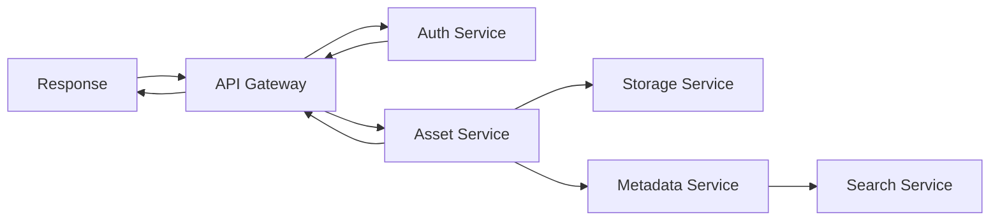

# Module 6: Advanced Troubleshooting

## Duration: 8 hours

## Learning Objectives
By the end of this module, trainees will be able to:
1. Diagnose complex multi-service issues
2. Analyze performance bottlenecks
3. Debug distributed system problems
4. Use advanced diagnostic tools
5. Implement emergency fixes
6. Create detailed root cause analyses

## 1. Advanced Diagnostic Techniques

### Distributed Tracing

#### Understanding Request Flow


#### Using Trace IDs
```bash
# Find all logs for a request
grep "trace-id: abc-123-def" /var/log/mams/*.log

# Query across services
curl -X GET "http://jaeger:16686/api/traces/abc-123-def"

# Analyze trace timing
{
  "trace_id": "abc-123-def",
  "spans": [
    {"service": "api-gateway", "duration": 5},
    {"service": "auth", "duration": 12},
    {"service": "asset", "duration": 145},
    {"service": "storage", "duration": 89}
  ],
  "total_duration": 251
}
```

### Deep Performance Analysis

#### Database Query Analysis
```sql
-- Find slow queries
SELECT 
  query,
  calls,
  total_time,
  mean_time,
  max_time
FROM pg_stat_statements
WHERE mean_time > 1000  -- queries over 1 second
ORDER BY mean_time DESC
LIMIT 20;

-- Analyze query plan
EXPLAIN (ANALYZE, BUFFERS) 
SELECT a.*, m.* 
FROM assets a
JOIN metadata m ON a.id = m.asset_id
WHERE a.created_at > NOW() - INTERVAL '7 days';

-- Find missing indexes
SELECT 
  schemaname,
  tablename,
  attname,
  n_distinct,
  correlation
FROM pg_stats
WHERE schemaname = 'public'
AND n_distinct > 100
AND correlation < 0.1
ORDER BY n_distinct DESC;
```

#### Service Profiling
```python
# CPU profiling
import cProfile
import pstats

profiler = cProfile.Profile()
profiler.enable()

# Code to profile
result = expensive_operation()

profiler.disable()
stats = pstats.Stats(profiler)
stats.sort_stats('cumulative')
stats.print_stats(20)  # Top 20 functions

# Memory profiling
from memory_profiler import profile

@profile
def memory_intensive_function():
    large_list = [i for i in range(1000000)]
    return sum(large_list)
```

### Network Diagnostics

#### TCP Connection Analysis
```bash
# Check connection states
netstat -tan | awk '{print $6}' | sort | uniq -c

# Find connection leaks
ss -s

# Monitor specific port
tcpdump -i any -n port 8000 -w capture.pcap

# Analyze packet capture
tshark -r capture.pcap -Y "http.response.code == 500"

# Connection pool stats
curl http://service:8000/metrics | grep connection_pool
```

## 2. Complex Issue Patterns

### Pattern 1: Cascading Failures

#### Symptoms
- Multiple services reporting errors
- Exponential increase in error rate
- System-wide slowdown
- Circuit breakers tripping

#### Root Cause Analysis
```bash
# 1. Identify the trigger point
grep -B5 "ERROR" /var/log/mams/*.log | head -50

# 2. Trace dependency chain
for service in api-gateway user-mgmt asset storage; do
  echo "=== $service ==="
  docker logs mams-$service --since 30m | grep -E "ERROR|WARN"
done

# 3. Check resource exhaustion
docker stats --no-stream

# 4. Verify circuit breaker status
curl http://api-gateway:8000/admin/circuit-breakers
```

#### Resolution Steps
1. **Isolate failing service**
   ```bash
   docker-compose scale problem-service=0
   ```

2. **Enable fallback responses**
   ```python
   CIRCUIT_BREAKER_ENABLED = True
   FALLBACK_MODE = True
   ```

3. **Gradually restore service**
   ```bash
   docker-compose scale problem-service=1
   # Monitor for 5 minutes
   docker-compose scale problem-service=2
   ```

### Pattern 2: Memory Leaks

#### Detection
```bash
# Monitor memory usage over time
while true; do
  docker stats --no-stream --format "table {{.Container}}\t{{.MemUsage}}"
  sleep 60
done > memory_usage.log

# Analyze growth pattern
awk '{print $2}' memory_usage.log | \
  sed 's/MiB//g' | \
  gnuplot -e "plot '-' with lines"
```

#### Heap Dump Analysis
```python
# Generate heap dump
import gc
import objgraph

# Before suspected leak
gc.collect()
objgraph.show_most_common_types(limit=20)

# After running for a while
gc.collect()
objgraph.show_growth(limit=20)

# Find reference chains
obj = objgraph.by_type('Asset')[0]
objgraph.show_backrefs(obj, filename='references.png')
```

### Pattern 3: Deadlocks

#### Database Deadlocks
```sql
-- View current locks
SELECT 
  pid,
  locktype,
  relation::regclass,
  mode,
  granted
FROM pg_locks
WHERE NOT granted;

-- Find blocking queries
SELECT 
  blocked_locks.pid AS blocked_pid,
  blocked_activity.usename AS blocked_user,
  blocking_locks.pid AS blocking_pid,
  blocking_activity.usename AS blocking_user,
  blocked_activity.query AS blocked_statement,
  blocking_activity.query AS blocking_statement
FROM pg_catalog.pg_locks blocked_locks
JOIN pg_catalog.pg_stat_activity blocked_activity ON blocked_activity.pid = blocked_locks.pid
JOIN pg_catalog.pg_locks blocking_locks ON blocking_locks.locktype = blocked_locks.locktype
JOIN pg_catalog.pg_stat_activity blocking_activity ON blocking_activity.pid = blocking_locks.pid
WHERE NOT blocked_locks.granted;

-- Kill blocking query
SELECT pg_cancel_backend(blocking_pid);
```

#### Application Deadlocks
```python
# Thread dump analysis
import threading
import traceback

def dump_threads():
    for thread_id, frame in sys._current_frames().items():
        thread = threading._active.get(thread_id)
        if thread:
            print(f"Thread: {thread.name}")
            traceback.print_stack(frame)
```

## 3. Emergency Response Procedures

### Critical Incident Response

#### Severity Levels
```yaml
P1 - Critical:
  description: Complete system outage
  response_time: 15 minutes
  escalation: Immediate
  team: On-call engineer + Manager

P2 - High:
  description: Major feature unavailable
  response_time: 1 hour
  escalation: After 30 minutes
  team: Senior support

P3 - Medium:
  description: Degraded performance
  response_time: 4 hours
  escalation: After 2 hours
  team: Regular support

P4 - Low:
  description: Minor issues
  response_time: 24 hours
  escalation: As needed
  team: Support queue
```

#### Incident Commander Checklist
1. **Assess Impact**
   - Number of users affected
   - Business functions impacted
   - Data integrity risk
   - Security implications

2. **Communicate Status**
   ```bash
   # Send initial notification
   ./scripts/incident-notify.sh P1 "Search service outage"
   
   # Update status page
   curl -X POST https://status.mams.com/api/incidents \
     -d '{"severity": "P1", "service": "search", "status": "investigating"}'
   ```

3. **Coordinate Response**
   - Assign roles (Commander, Communicator, Investigator)
   - Create war room channel
   - Start incident timeline
   - Begin root cause investigation

### Emergency Fixes

#### Service Restart Procedures
```bash
#!/bin/bash
# safe-restart.sh - Graceful service restart

SERVICE=$1
echo "Starting safe restart of $SERVICE"

# 1. Put service in maintenance mode
curl -X PUT http://$SERVICE:8000/admin/maintenance -d '{"enabled": true}'

# 2. Wait for active requests to complete
echo "Waiting for active requests..."
sleep 30

# 3. Restart service
docker-compose restart $SERVICE

# 4. Health check
for i in {1..30}; do
  if curl -f http://$SERVICE:8000/health; then
    echo "Service healthy"
    break
  fi
  sleep 10
done

# 5. Exit maintenance mode
curl -X PUT http://$SERVICE:8000/admin/maintenance -d '{"enabled": false}'
```

#### Database Emergency Procedures
```sql
-- Kill all connections
SELECT pg_terminate_backend(pid)
FROM pg_stat_activity
WHERE datname = 'mams_db' AND pid <> pg_backend_pid();

-- Emergency vacuum
VACUUM FULL ANALYZE;

-- Reset statistics
SELECT pg_stat_reset();

-- Rebuild indexes
REINDEX DATABASE mams_db;
```

#### Cache Flush
```bash
# Redis full flush
redis-cli FLUSHALL

# Selective flush
redis-cli --scan --pattern "cache:*" | xargs redis-cli DEL

# OpenSearch cache clear
curl -X POST "http://opensearch:9200/_cache/clear"
```

## 4. Root Cause Analysis

### RCA Process

#### 5 Whys Technique
```
Problem: Users cannot upload files

Why 1: Upload requests are timing out
→ Because: Requests take longer than 60 seconds

Why 2: Requests take too long
→ Because: Proxy generation is slow

Why 3: Proxy generation is slow
→ Because: FFmpeg process is queuing

Why 4: FFmpeg processes are queuing
→ Because: Limited to 2 concurrent processes

Why 5: Limited concurrent processes
→ Because: Configuration was not updated after hardware upgrade

Root Cause: FFmpeg concurrency limit not adjusted for new hardware
```

#### RCA Template
```markdown
# Root Cause Analysis: [Incident ID]

## Executive Summary
- **Date**: 2024-01-15
- **Duration**: 2 hours 15 minutes
- **Impact**: 5,000 users unable to upload
- **Root Cause**: Insufficient FFmpeg workers

## Timeline
- 10:00 - First reports of upload failures
- 10:15 - Support team identifies pattern
- 10:30 - Escalated to Level 2
- 10:45 - Root cause identified
- 11:00 - Fix implemented
- 12:15 - Service fully restored

## Technical Details
[Detailed technical analysis]

## Lessons Learned
1. Need better capacity planning
2. Monitoring gap for queue depth
3. Configuration management process

## Action Items
- [ ] Increase FFmpeg workers to 8
- [ ] Add queue depth monitoring
- [ ] Document capacity planning
- [ ] Review all service limits
```

## 5. Advanced Monitoring

### Custom Metrics

#### Application Metrics
```python
from prometheus_client import Counter, Histogram, Gauge

# Define metrics
upload_queue = Gauge('mams_upload_queue_size', 'Current upload queue size')
processing_time = Histogram('mams_processing_seconds', 'Processing time', 
                          buckets=[0.1, 0.5, 1, 2, 5, 10, 30, 60])
error_counter = Counter('mams_errors_total', 'Total errors', ['service', 'type'])

# Use metrics
@processing_time.time()
def process_upload(file):
    upload_queue.inc()
    try:
        # Process file
        result = process(file)
    except Exception as e:
        error_counter.labels(service='upload', type=type(e).__name__).inc()
        raise
    finally:
        upload_queue.dec()
    return result
```

#### Custom Dashboards
```json
{
  "dashboard": {
    "title": "MAMS Advanced Diagnostics",
    "panels": [
      {
        "title": "Service Latency Heatmap",
        "query": "histogram_quantile(0.95, http_request_duration_seconds_bucket)",
        "type": "heatmap"
      },
      {
        "title": "Error Rate by Service",
        "query": "rate(mams_errors_total[5m])",
        "type": "graph"
      },
      {
        "title": "Queue Depths",
        "query": "mams_upload_queue_size",
        "type": "gauge"
      }
    ]
  }
}
```

### Log Analysis

#### Advanced Log Queries
```bash
# Correlation analysis
awk '/ERROR/ {print $4}' *.log | sort | uniq -c | sort -rn

# Time-based error distribution
awk '/ERROR/ {print substr($1,12,2)}' *.log | sort | uniq -c

# Extract stack traces
sed -n '/ERROR/,/^[[:space:]]*$/p' app.log > errors.txt

# Find error patterns
grep -A5 -B5 ERROR *.log | \
  awk '/ERROR/ {getline; getline; print}' | \
  sort | uniq -c | sort -rn
```

## 6. Performance Optimization

### Query Optimization

#### Slow Query Fixes
```sql
-- Before: Full table scan
SELECT * FROM assets WHERE metadata->>'camera' = 'Canon';

-- After: Use GIN index
CREATE INDEX idx_metadata_camera ON assets USING gin ((metadata->'camera'));
SELECT * FROM assets WHERE metadata @> '{"camera": "Canon"}';

-- Before: Multiple queries
SELECT * FROM assets WHERE id = 123;
SELECT * FROM metadata WHERE asset_id = 123;
SELECT * FROM versions WHERE asset_id = 123;

-- After: Single query with joins
SELECT 
  a.*,
  m.metadata,
  array_agg(v.*) as versions
FROM assets a
LEFT JOIN metadata m ON a.id = m.asset_id
LEFT JOIN versions v ON a.id = v.asset_id
WHERE a.id = 123
GROUP BY a.id, m.id;
```

### Caching Strategies

#### Multi-Layer Caching
```python
import redis
from functools import wraps

redis_client = redis.Redis()

def cached(ttl=3600):
    def decorator(func):
        @wraps(func)
        async def wrapper(*args, **kwargs):
            # L1: Local memory cache
            cache_key = f"{func.__name__}:{args}:{kwargs}"
            if cache_key in local_cache:
                return local_cache[cache_key]
            
            # L2: Redis cache
            redis_value = redis_client.get(cache_key)
            if redis_value:
                value = json.loads(redis_value)
                local_cache[cache_key] = value
                return value
            
            # L3: Database
            value = await func(*args, **kwargs)
            
            # Update caches
            redis_client.setex(cache_key, ttl, json.dumps(value))
            local_cache[cache_key] = value
            
            return value
        return wrapper
    return decorator
```

## 7. Disaster Recovery

### System Recovery Procedures

#### Full System Recovery
```bash
#!/bin/bash
# disaster-recovery.sh

echo "Starting disaster recovery..."

# 1. Verify backups
aws s3 ls s3://mams-backups/latest/

# 2. Restore databases
echo "Restoring databases..."
./restore-postgres.sh
./restore-mongodb.sh
./restore-redis.sh

# 3. Verify data integrity
echo "Verifying data..."
./verify-integrity.sh

# 4. Start services in order
echo "Starting services..."
docker-compose up -d postgres mongodb redis
sleep 30
docker-compose up -d api-gateway user-mgmt
sleep 20
docker-compose up -d asset storage metadata
sleep 20
docker-compose up -d search proxy workflow

# 5. Run health checks
echo "Running health checks..."
./health-check-all.sh

# 6. Restore from cloud storage
echo "Restoring assets..."
./restore-assets.sh

echo "Recovery complete!"
```

### Data Recovery

#### Corrupted Data Recovery
```sql
-- Identify corrupted data
SELECT id, name, size_bytes 
FROM assets 
WHERE size_bytes < 0 OR size_bytes > 1099511627776;  -- 1TB

-- Fix with backup data
UPDATE assets a
SET size_bytes = b.size_bytes
FROM backup.assets b
WHERE a.id = b.id
AND a.size_bytes < 0;

-- Verify foreign key integrity
SELECT a.id 
FROM assets a
LEFT JOIN users u ON a.owner_id = u.id
WHERE u.id IS NULL;
```

## Hands-On Exercises

### Exercise 1: Distributed Debugging (90 min)
1. Simulate multi-service failure
2. Use distributed tracing
3. Identify root cause
4. Implement fix
5. Verify resolution

### Exercise 2: Performance Crisis (60 min)
1. Create performance bottleneck
2. Use profiling tools
3. Identify slow queries
4. Optimize and test
5. Document findings

### Exercise 3: Emergency Response (45 min)
1. Simulate P1 incident
2. Follow incident process
3. Implement emergency fix
4. Write RCA report
5. Present findings

### Exercise 4: Data Recovery (45 min)
1. Corrupt test data
2. Identify corruption
3. Restore from backup
4. Verify integrity
5. Update procedures

## Advanced Tools Reference

### Performance Tools
- **pprof**: Go profiling
- **py-spy**: Python profiling
- **Artillery**: Load testing
- **Gatling**: Performance testing
- **JMeter**: Stress testing

### Debugging Tools
- **strace**: System call tracing
- **tcpdump**: Network analysis
- **gdb**: Process debugging
- **dtrace**: Dynamic tracing
- **perf**: Linux profiling

### Monitoring Tools
- **Prometheus**: Metrics
- **Grafana**: Visualization
- **Jaeger**: Distributed tracing
- **ELK Stack**: Log analysis
- **Sentry**: Error tracking

## Summary

In this module, you learned:
- Advanced diagnostic techniques
- Complex issue patterns and solutions
- Emergency response procedures
- Root cause analysis methods
- Performance optimization strategies
- Disaster recovery procedures

Congratulations! You've completed the MAMS Advanced Support Training Program.

## Certification

To receive your certification:
1. Complete all module exercises
2. Pass the written exam (80% required)
3. Complete practical assessment
4. Submit one real-world RCA

Good luck in your role as a MAMS Support Expert!